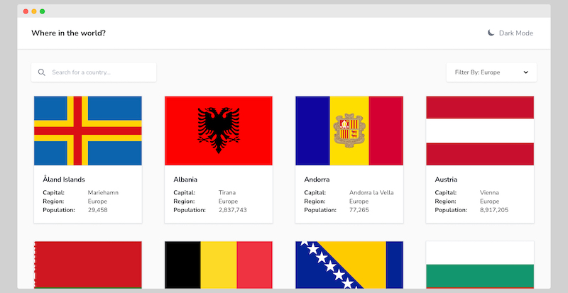

# Countries: Vue

**Frontend Mentor - REST Countries API with color theme switcher solution**

This is a solution to the [REST Countries API with color theme switcher challenge on Frontend Mentor](https://www.frontendmentor.io/challenges/rest-countries-api-with-color-theme-switcher-5cacc469fec04111f7b848ca). Frontend Mentor challenges help you improve your coding skills by building realistic projects. 

## Overview

### The challenge

Users should be able to:

- See all countries from the API on the homepage
- Search for a country using an `input` field
- Filter countries by region
- Click on a country to see more detailed information on a separate page
- Click through to the border countries on the detail page
- Toggle the color scheme between light and dark mode

### Screenshot

### Built with

- Semantic HTML5 markup
- CSS Grid
- Mobile-first workflow
- [Vue](https://vuejs.org/) - JS framework
- [Tailwind CSS](https://tailwindcss.com/) - For styles

## Author

- Website - [Web Guy Ian](https://webguyian.com/)
- GitHub - [@webguyian](https://github.com/webguyian)
- Frontend Mentor - [@webguyian](https://www.frontendmentor.io/profile/webguyian)
